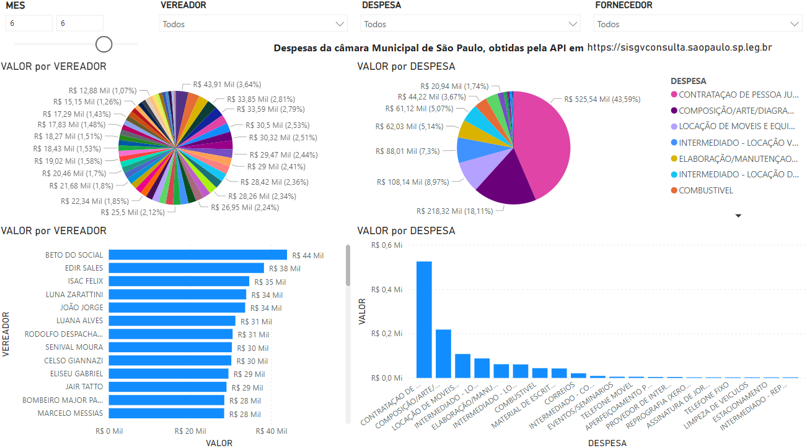
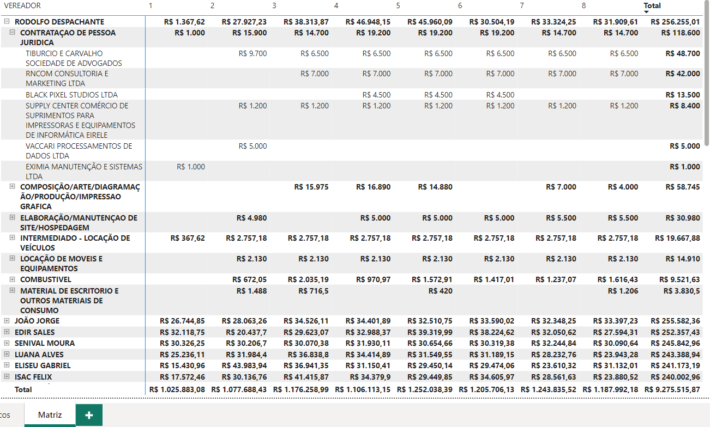

# Vereadores

Projeto com objetivo de analisar vereadores por meio dos dados dos portais de transparência

## Exemplos em Jupyter Notebook em Python (*.ipynb)

Conteúdo meramente instrutivo, exemplificando como usar linguegens de programação python para ler dados abertos de portais quaisquer, no caso aqui os portais de transparência de algumas cidades

* [gabinete-campinas.ipynb](gabinete-campinas.ipynb)
* [gabinete-sp-detalhe.ipynb](gabinete-sp-detalhe.ipynb)
* [gabinete-sp.ipynb](gabinete-sp.ipynb)
* [santo-andre.ipynb](santo-andre.ipynb)

## Exemplo Power BI

Gráficos com dados da Câmara Municipal de São Paulo, até mês agosto/2023

A fonte de dados foi obtida por meio do programa [gabinete-sp-api.ipynb](gabinete-sp-api.ipynb) que tem vários exemplos de como usar a API do portal da transparência [sisgvconsulta.saopaulo.sp.leg.br](https://sisgvconsulta.saopaulo.sp.leg.br), onde no final gero o arquivo [detalhe_sp_2023.csv](detalhe_sp_2023.csv) com compondo os vários meses.

Para abrir o programa recomendo usar o [Colab Google](https://colab.google/), ou instalar as ferramentas Python necessárias

[Baixe o PowerBI, gratuitamente no site da Microsoft](https://powerbi.microsoft.com/pt-br/downloads) e baixe e abra o arquivo [SP-Capital.pbix](SP-Capital.pbix) para poder visualizar de forma interativa.

Veja também:

* [SCS.pbix](SCS.pbix) - Gráficos de São Caetano do Sul

### Convite

Participe dessa iniciativa, fazendo um Fork, e submetendo mais exemplos com dados da sua cidade, provendo assim informação mais organizada com os dados abertos.

Participe da comunidade, e do grupo de programação em [Python no WhatsApp](https://chat.whatsapp.com/CJRyNwXXhnQ10JUiWhdZEN)
